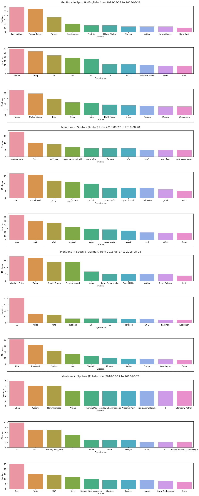

Sputnik Named Entities 
=================

Sputnik and Russia Today are Russian propaganda-news sites that the [New York Times](https://www.nytimes.com/2017/09/13/magazine/rt-sputnik-and-russias-new-theory-of-war.html?rref=collection/sectioncollection/magazine&action=click&contentCollection=magazine&region=rank&module=package&version=highlights&contentPlacement=5&pgtype=sectionfront&_r=0) has described as "the most effective propaganda operation of the 21st century so far." 

This tool scrapes news articles from Sputnik and then performs Named Entity Recognition to extract the people, organizations, and locations that Sputnik reporting is focusing on. The tool currently works with data from the Sputnik sites in English, Arabic, German, and Polish.


<br>

### Installation

1. Install python 3.6 and jupyter-notebook if you don't already have them.
2. Use a tool like pip or conda to install the libraries from [requirements.txt](requirements.txt). Some of the depended-on libraries are not packaged with anaconda or jupyter-notebook by default.
3. Configure jupyter-notebook to use the python kernel that you installed the requirements to in place of its default kernel. Using conda, this can be done by installing the [nb_conda](https://anaconda.org/anaconda/nb_conda) package with `$ conda install nb_conda`.
4. Download the polyglot models for the supported languages. Ex:
```
$ polyglot download embeddings2.en
$ polyglot download ner2.en
$ polyglot download embeddings2.ar
$ polyglot download ner2.ar
$ polyglot download embeddings2.de
$ polyglot download ner2.de
$ polyglot download embeddings2.pl
$ polyglot download ner2.pl
```
5. Open the notebook with `$ jupyter-notebook sputnik_named_entities.ipynb`

<br>

### Example Output
